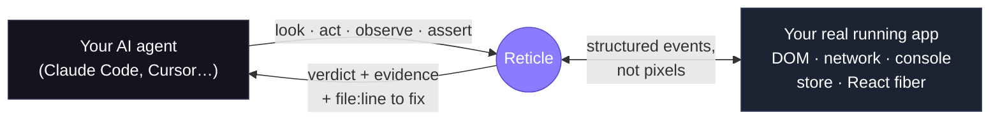

<div align="center">

<picture>
  <source media="(prefers-color-scheme: dark)" srcset="assets/readme/lockup-on-dark.png" />
  
</picture>

<br/><br/>

**Your AI agent says "Feature complete." Then you open the app:**

✗ &nbsp;a silent `500` under a page that looks perfect &nbsp; ✗ &nbsp;a flow that used to work, now broken &nbsp; ✗ &nbsp;mock data where the real API should be

### Reticle is the proof layer for AI agents.

It makes your agent **test its own work on every edit** — reading the running _program_ (network, store state, signals, the React commit stream), not a screenshot — and hands back a **pass/fail verdict with the `file:line` to fix.**

<a href="https://reticle.sh"></a>

[](https://www.npmjs.com/package/@reticlehq/react) [](https://www.npmjs.com/package/@reticlehq/react) [](https://github.com/reticlehq/reticle/stargazers) [](LICENSE) [](https://securityscorecards.dev/viewer/?uri=github.com/reticlehq/reticle) [](https://www.npmjs.com/package/@reticlehq/react)

**[⚡ Install in 30 seconds](#install-in-30-seconds)** · [How it works](#how-it-works) · [Why not Playwright / DevTools / a browser agent](#why-not-playwright-mcp-a-browser-agent-or-devtools) · [The numbers](#the-numbers) · [Docs](docs/getting-started.md)

`dev-only` · `localhost-only` · `your app data stays local` · `Apache-2.0 SDK` · works with Claude Code, Cursor, and any MCP agent

</div>

---

## The problem

Your agent edits code, **assumes** it worked, and moves on. It doesn't run your Playwright suite between every change — so the broken modal, the silent `500`, the store that says `deployed` when the deploy failed all ship, and you find them by hand. You've become your agent's QA.

The truth is right there in the running app — the network response, the store state, the signal that fired — but it **never reaches the screen.** A screenshot sees a page that looks perfect. Your agent sees nothing at all.

<p align="center">
  
</p>

## What Reticle is

Reticle embeds a tiny **dev-only** SDK in your app and exposes its runtime to your agent over **MCP**. The agent drives the _real_ running app and, in one call, asserts over the **network, store state, custom signals, console, and the React render stream** — then gets back a verdict:


```jsonc
// The agent clicked "Pay". Did the right things actually happen? One call, ~33 tokens, no screenshot:
reticle_assert({
  predicate: { allOf: [
    { kind: "net",     method: "POST", urlContains: "/api/order", status: 200 },
    { kind: "element", query: { role: "dialog", name: "Order confirmed" }, state: "visible" },
    { kind: "signal",  name: "order:saved" },          // the charge actually committed
    { kind: "console", level: "error", absent: true }  // …and nothing errored
  ]}
})
// → { pass: false,
//     failureReason: "POST /api/order returned 500, expected 200",
//     source: { file: "src/checkout/PayButton.tsx", line: 42 } }   ← caught before you ever saw it
```

No test syntax to learn — you describe the outcome in plain English, the agent does the rest. **Playwright gates releases. Reticle gates edits.**

## How it works



One call checks many things at once and comes back with **proof** — deterministic (structured events, not a vision model), cheap (any model, no screenshot), and pointed at the code. Record that journey once and Reticle **replays it deterministically on every later edit: no model, 0% flake, ~47 tokens for a whole suite** — a regression net that runs _inside_ the agent's loop instead of waiting for CI.

## Why not Playwright MCP, a browser agent, or DevTools?

They all look at the app from _outside the browser_. On the app you're building, that's the wrong side of the glass — the bugs that matter never reach the pixels or the DOM.

| Tool | What it sees | What it misses on the app you own |
| --- | --- | --- |
| **Screenshot / browser agent** | pixels | the silent `500`, the wrong store value, the double-submit, the render storm — **none reach the screen** |
| **Playwright MCP / DevTools MCP** | the DOM + raw CDP | app **state**, custom **signals**, the **React commit** stream — and no **`file:line`** to hand back |
| **Reticle** | the **program**: network, store state, signals, console, React fiber | _(built for apps you own — it can't test a site you don't ship; that's Playwright's job)_ |

**Concretely — every one of these looks fine on screen, and only Reticle catches it:**

| The bug | Reticle catches it because it reads… |
| --- | --- |
| Pay button silently returns **500** | the **network** response, tied to the click |
| A **console error** slipped in, UI still renders | the **console** stream since the action |
| The form fired the request **twice** | request **cardinality** (`net { count: 1 }`) |
| The badge shows "12" but the **store** holds 0 | the app's **state**, not the rendered number |
| "Deploy succeeded" — the deploy actually **failed** | the store's **real** status |
| The component re-renders **60×/sec** for nothing | the **React commit** stream |

> **Use both.** Playwright is the right tool for a site you don't own, many browsers, or true pixels. Reticle is your cheap, deterministic, state-aware inner loop while the agent codes. Full [when-to-use-which](docs/getting-started.md) in the docs.

## The numbers

We injected **88 real regressions** into a controlled app and ran Reticle head-to-head against a Playwright script. Every number is produced by a committed harness — reproduce it with `pnpm bench`.

|  | **Reticle** | Playwright (script) |
| --- | :-: | :-: |
| **Critical bugs caught** (silent 500s, wrong data, bad state) | **26 / 26** | 9 / 26 |
| All injected bugs caught | **86 / 88** | 60 / 88 |
| False alarms on a clean build | **0** | 0 |
| Reads app **state / signals / React commits** | **✓** | ✗ — DOM only |
| Hands back the **`file:line`** to fix | **✓** | ✗ |
| Regression replay | **0% flake · no model · ~47 tok/suite** | re-drive with the LLM |

The gap is widest exactly where it hurts: **26 vs 9** on the bugs that corrupt data or hide a failure. And the `file:line` isn't cosmetic — in our ablation it cut an agent's fix-loop **tool calls by 45%.**

> **The proof that mattered most:** before we instrumented anything, Reticle's _first_ pass on our own production dashboard flagged two live `500`s (`GET /projects`, `/recovery/incidents`) that the UI completely hid. The page looked perfect. A screenshot would have called it done.

→ [Full scorecard, including where we lose](bench/SCORECARD.md) · [Confidence, claim by claim](bench/CONFIDENCE.md) · [What Reticle catches that Playwright can't, and why](bench/pw-vs-reticle/MOAT.md)

## Install in 30 seconds

**Easiest — paste one line into your agent:**

```text
Follow https://raw.githubusercontent.com/reticlehq/reticle/main/SKILL.md
```

It auto-detects whether Reticle is set up, runs the wizard the first time, and verifies your app every time after. Works with Claude Code, Cursor, OpenCode, and any MCP agent.

**Or via CLI** — auto-detects your framework, installs the kit + build plugin, and registers the MCP server for every agent in one shot:

```bash
npx @reticlehq/server init
```

**Or register the MCP server directly in Claude Code** (then restart it):

```bash
claude mcp add reticle -s user -- npx @reticlehq/server mcp
```

<details>
<summary><b>Manual setup — install + wire it yourself</b></summary>

<br/>

**1. Install** the SDK kit + your framework's build plugin (the kit re-exports the browser sensor):

```bash
npm i -D @reticlehq/react @reticlehq/vite-plugin        # Vite; or pnpm / yarn / bun
# Next.js instead? npm i -D @reticlehq/react @reticlehq/next
```

**2. Register the MCP server** — `npx @reticlehq/server mcp` _is_ the server:

```jsonc
// .mcp.json
{ "mcpServers": { "reticle": { "command": "npx", "args": ["@reticlehq/server", "mcp"] } } }
```

**3. Connect the dev-only SDK** from your app entry (tree-shaken out of production):

```ts
// main.tsx — dev only
import { reticle } from '@reticlehq/react';
if (import.meta.env.DEV) reticle.connect({ session: 'my-app' });
// React? add `import { install } from "@reticlehq/react"; install()` before connect for component → file:line.
```

Full walkthrough → [Getting Started](docs/getting-started.md).

</details>

## Use it in plain English

> **You:** "Verify login works: it should call `/api/login`, land on the dashboard, and set the signed-in user."
>
> **Agent, via Reticle:** clicks **Sign in** → `POST /api/login → 200 (14 ms)` → dashboard rendered → store now holds `auth: { email: "admin@…" }` → **✅ PASS**, with that evidence attached. Had it failed, you'd get the failing check **and the `file:line`** instead of a guess.

Then say _"save that as a flow"_ — and it replays deterministically on every later edit, no model, 0% flake. Your acceptance criteria and "I just eyeball it" steps become checks the agent runs automatically, including the long tail nobody ever automated.

→ [Getting Started](docs/getting-started.md) · [Full guide: every tool, predicate & the flow DSL](docs/usage.md) · [One browser, a fleet of agents in parallel](docs/multi-agent-testing.md)

---

<div align="center">

### If Reticle proves useful, a ⭐ helps other developers find it.

Built in the open, for the long run. Everyone who stars, forks, or contributes is credited below.

<a href="https://github.com/reticlehq/reticle/graphs/contributors"></a>

</div>

## What's inside

A pnpm + turbo monorepo — each audience installs only what it needs (apps embed `@reticlehq/react`; agents run `@reticlehq/server`):

| Package | Role |
| --- | --- |
| `@reticlehq/core` | the wire contract (types, zod schemas, constants) everything imports — depends only on `zod` |
| `@reticlehq/browser` | the dev-only instrumentation SDK (DOM / network / console / state observers) |
| `@reticlehq/react` | the React kit: SDK + adapter, DOM ref → component → source `file:line` |
| `@reticlehq/vite-plugin` · `-next` · `-babel-plugin` | dev-only source mapping + `connect()` injection (Vite / Next.js / React 19) |
| `@reticlehq/server` | the bridge + MCP server + the `reticle` CLI |
| `@reticlehq/test` · `-eslint-plugin` | declarative CI specs · the "state change must fire a signal" lint rule |

## Status & safety

**Dev-only** and **localhost-only** by design: the SDK is tree-shaken out of production builds, the bridge binds to localhost, and **no app data ever leaves your machine** — Reticle observes _your_ app on _your_ machine. The CLI reports anonymous, opt-out usage metrics only (a random id + event names; no code, no PII — [full policy](docs/telemetry.md)); opt out with `reticle telemetry disable`.

## License

A per-package model, so it's safe to embed in your app and fair to build a business on (each package's `LICENSE` is authoritative; see the root [LICENSE](LICENSE)):

- **Embedded in your app → Apache-2.0.** `core`, `browser`, `react`, `next`, `vite-plugin`, `babel-plugin`, `eslint-plugin` compile into your application. Use them anywhere, including apps you ship to customers. No copyleft; explicit patent grant.
- **Server / CLI / MCP → FSL-1.1-ALv2.** `server` and `test` are free for any use except offering Reticle itself as a competing hosted service; each release converts to Apache-2.0 after two years.
- **Enterprise features → Reticle Enterprise License.** Source-available under `packages/server/src/ee/`; free to evaluate, a key is required in production.

New here? See [CONTRIBUTING.md](CONTRIBUTING.md), [GOVERNANCE.md](GOVERNANCE.md), and the [ROADMAP](ROADMAP.md). Contributions are certified under the [DCO](https://developercertificate.org) — just `git commit -s`. OEM / commercial licensing: **[hey@reticle.sh](mailto:hey@reticle.sh)**

<div align="center">

© 2026 Reticle HQ · **[Install](#install-in-30-seconds)** · [Docs](docs/getting-started.md) · [Benchmarks](bench/SCORECARD.md) · [reticle.sh](https://reticle.sh)

</div>
